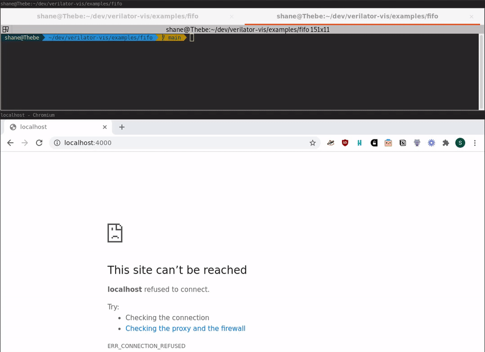

## Verilator-vis 0.0.1

A tool to help draw high-level interactive diagrams for hardware simulations running in Verilator.
This is primarily used for teaching custom digital design to undergraduate students.



In the above example we can see a simple FWFT FIFO being visualised. 
1. We start the webserver rendering the diagram
2. The we start the Verilator simulation of the FIFO module
3. We can then issue commands from the webinterface, in this case `play 12` which means play the simulation for 12 clock cycles.
4. During the simulation data is written to and read from the FIFO and we can see this represented in the diagram.
5. We input the `end` command into the web interfaces terminal. This stops the Verilator simulation
6. It is then possible to inspect the simulation at a deeper level looking at the wave forms with gtkwave.

---------------------------------------------------------------

### Visualisation data structure

Every cycle Verilator sends user-specified data to the web frontend using websockets. The various javascript APIs then use this data to update the state of the diagram shown on the screen.

The data structure for what data is sent over websockets is defined in a json file. For the FIFO example, the json file looks like the following:

```
{
    "struct_name": "fifo_vis",
    "signals": [
        { "struct_name" : "write",
           "signals": [
                {
                    "name": "wr_data",
                    "width": 32 
                },
                {
                    "name": "wr_valid",
                    "width": 1 
                }
           ]
        },
        { "struct_name" : "read",
            "signals" : [
                {
                    "name": "rd_data",
                    "width" : 32 
                },
                {
                    "name" : "rd_valid",
                    "width" : 1 
                }
            ]
        }
    ]
}
```

This describes a hierarchical structure with signal names and their widths. 
In the hardware we can then make assignments to this structure.
The tool will generate two versions, a SystemVerilog struct that can be included in the hardware, an a C++ header file that parses the data coming out of the simulation in the Verilator C++ top-level file and transmits it via websockets as another json object.

For the FIFO example we can include the generated SystemVerilog struct in our hardware.
```
import verilatorVis::*;
```

And then make assignments to it within our design.
```
   always_comb begin
        vis_out = {$bits(fifo_vis_dvis_t){1'b0}};

        vis_out.write.wr_data = wr_data_in;
        vis_out.write.wr_valid = wr_valid_in && ~fifo_full;
        vis_out.read.rd_data = rd_data_out;
        vis_out.read.rd_valid = rd_ready_in && rd_valid_out;
   end

```

The Verilator simulation will then parse this data and send it over json to our connected web frontend. 
For our FIFO example, the JSON struct at the web frontend looks like the following:

```
{
	"fifo_vis": {
		"read": {
			"rd_data": 0,
			"rd_valid": 0
		},
		"write": {
			"wr_data": 42,
			"wr_valid": 1
		}
	}
}
```
This can then be parsed and the JavaScript libraries provided can be used to render it on the webpage.

## Setting up
1. Clone this repositiory with 

## Running the example
To run the simple FIFO example type the following:

```
cd examples/fifo
make visualiser

make run
```

